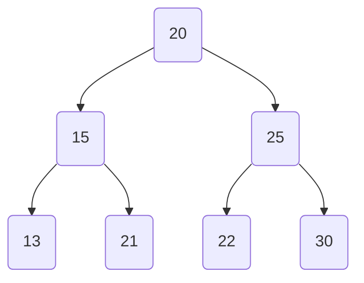

**Justin Ciocoi**

**Nov. 17, 2023**

# CSCI 377 Computer Algorithms Video Notes

## Chapter 12: Binary Search Trees

- What is a *Binary Search Tree?*
  
  - A binary tree is a data structure in which each node maintains a key, or value, and 3 links:
    
    - One to the left child, *left*
    
    - One to the right child, *right*
    
    - One to the parent, *p*
  
  - If any link is empty, we say it is *NIL*
  
  - Root has $p = NIL$ since the root has no parent 
  
  - Leaves have both left and right set as *NIL*
  
  - "NIL" here refers to the absence of a value
  
  - **Definition:** *Binary Search Tree*
    
    - A binary search tree is a tree in which for each node, the value of all the nodes in the left sub-tree are lesser or equal, and the value of all the nodes in the right subtree are greater or equal to the original node
    
    - For example, this *is* a binary search tree:


                - And this *is not* a binary search tree



- **Tree Walks**
  
  - *In-order Tree Walk*
    
    - Visit left child, then parent, then right child
  
  - *Pre-order Tree Walk*
    
    - Visit parent, then left child, then right child
  
  - *Post-order Tree Walk*
    
    - Visit left child, then right child, then parent 

- **More on Tree Walks**
  
  - For an in-order tree walk on a binary search tree with $n$ nodes, the operation takes $\Theta(n)$ time
  
  - *In-order tree walk algorithm*
    
    ```
    inOrderTreeWalk(x)
    {
        if x != NIL
        {
            inOrderTreeWalk(x.left)
            print(x)
            inOrderTreeWalk(x.right)
        }
    }
    ```

- **Searching in a Binary Search Tree**
  
  - For example, to search for $n$
    
    1. Start at the root. If it is $n$, stop
    
    2. Compare $n$ with the root
       
       - If it is smaller look only at the left sub-tree
       
       - If it is larger look only at the right sub-tree
    
    3. Compare $n$ with with either the left or right child of the root, and effectively restart the processes treating the appropriate child as the new root in the search 

- **Balance Trees**
  
  - We can call a tree *balanced* if for all nodes, the difference between the heights of the right and left sub-trees is not greater than $1$
  
  - In a balance tree, the running time for a search in a binary tree is $T(n)=\Theta(log(n))$
  
  - In a fully unbalanced tree, the running time will be $T(n)=O(n)$ since for each traversal down the tree, the search space is reduced by only one

- In a binary search tree, by definition, the smallest value is in the leftmost node and the greatest value is in the rightmost node 

- **Operations on a Binary Search Tree**
  
  - *Insert(T, z)*
    
    - Walk through the tree starting at the root
    
    - Find the leaf position where z fits
  
  - *Delete(T, z)*
    
    - 3 Possible Cases
      
      1. If z has no children, delete z and modify its parent's link by setting it to NIL
      
      2. If z has one child, elevate the child to take z's position in the tree by replacing the parent's link to point at z's child
      
      3. If z has 2 children, we need to find the successor, y, to take z's place and attach z's right sub-tree to y's right sub-tree as well as z's left sub-tree to y's left sub-tree
         
         - This can be achieved *recursively*
