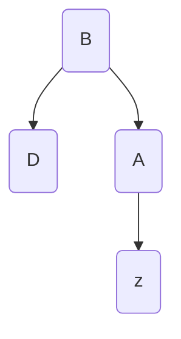

## Chapter 13: Red-Black Tree Insertion

- **Red-Black Trees**
  
  - A *red-black tree* is a self-balancing binary search tree 
  
  - A red-black tree will have the following properties
    
    - *Every* node is either red or black
    
    - The *root* is black
    
    - Each leaf, (NIL), is black
    
    - If a node is red, its children are black 

- **Relationship of a node, $z$ in a binary tree**

- Here, we call node $A$ node $z$'s parent, node $B$ its grandparent, and node $D$ its uncle

- **Strategy of Insertion in a Red-Black Tree**
  
  - Insert node $z$ as a red node
  
  - Next, we re-color and rotate nodes in order to fix any violations of the rules of a red-black tree
  
  - There are four possible cases here
    
    1. If $z$ is the root
       
       - All we need to do is insert the z and color it black instead of red
    
    2. If $z$ has a red uncle
       
       1. You must recolor the parent, grandparent, *and* uncle of node $z$
    
    3. If $z$ has a black uncle and forms a triangle with the parent (i.e. if the parent is a right child and $z$ is a left child or if the parent is a left child and $z$ is a right child)
       
       - We rotate $z$'s parent with $z$
         
         - if $z$ is the right child of $A$, now $A$ will be the left child of $z$
    
    4. If z has a black uncle and forms a line with the parent (i.e. if the parent is a right child and z is a right child or if the parent is a left child and z is a left child)
       
       - First, rotate $z$'s grandparent
       
       - Then, recolor $z$'s *original* parent and grandparent after rotation

- In a red-black tree, insertion and deletion operations each take $O(log(n))$ time because of tree rotation
