**Justin Ciocoi**

**Nov. 2, 2023**

# CSCI 377 Video Notes

## Chapter 6: Heap Sort

#### Keys to Understanding Heap Sort

- Understanding *heaps*

- Understanding *heap operations*
  
  - Insertion
  
  - Deletion
  
  - Heapify

- Understanding priority queues

#### Defining the Heap

- A *heap* is a *nearly complete binary tree*

- The *root* of the tree is $A[1]$

- The parent of $A[i]$ in a heap is $A[[\frac i2]]$

- The *left* child of $A[i]$ is $A[2i]$

- The *right* child of $A[i]$ is $A[2i+1]$

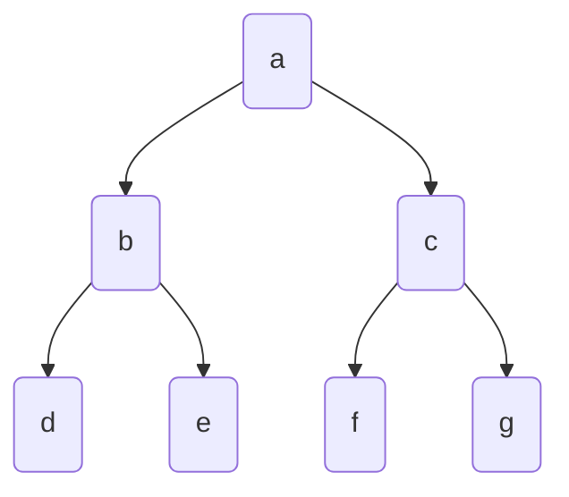

- Here, the heap goes from level 1 to level 3 from top to bottom, and can be represented in an array as follows

- | Index       | 1   | 2   | 3   | 4   | 5   | 6   |     |
  | ----------- |:---:|:---:|:---:|:---:|:---:|:---:| --- |
  | **Element** | a   | b   | c   | d   | e   | f   |     |

- So, for example, if $A[i] = b$
  
  - $b$ is at $A[2]$, so $i=2$
  
  - $b$'s left child is at $A[2i]=A[2*2]=A[4]$, which is $d$
  
  - $b$'s right child is at $A[2i+1]=A[2*2+1]=A[5]$, which is $f$
  
  - $b$'s parent is at $A[[\frac i2]]=A[[\frac22]]=A[1]$, which is $a$

#### What is a *Full Binary Tree*?

- This describes a binary tree where each node has two child nodes

- For example:

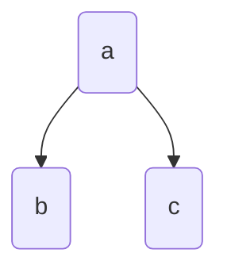

****

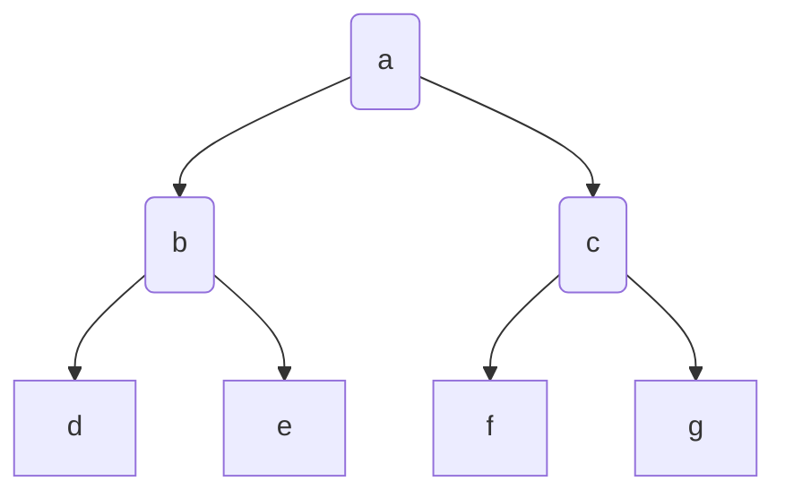

- From this, we can see that based on the number of levels in a tree, $n$, in a full binary tree, the tree will have exactly $2^{n+1}-1$ nodes

#### What is a *Complete Binary Tree*

- In a *complete* binary tree, all levels of the tree are filled up except possibly the highest level, which is filled form left to right such that the array representation of the binary tree does not have any gaps

#### Max Heap

- In a max heap, the root is the largest value in the heap, and every parent has a value greater than its child, for example:

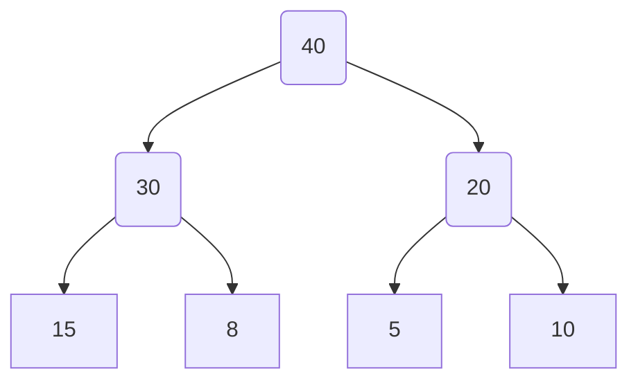

****

| Index       | 1   | 2   | 3   | 4   | 5   | 6   | 7   |
| ----------- | --- | --- | --- | --- | --- | --- | --- |
| **Element** | 40  | 30  | 20  | 15  | 8   | 5   | 10  |

#### Min Heap

- conversely, in a min heap, the root is the smallest value in the heap, and every parent has a value smaller than its child, for example:

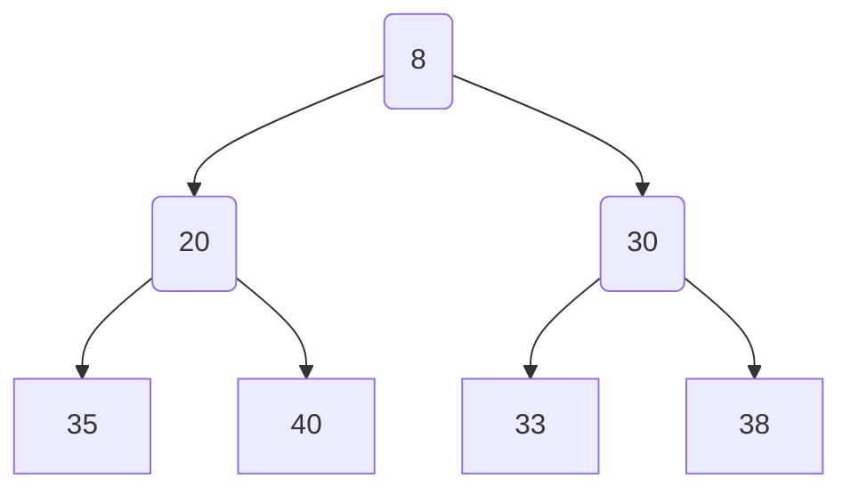

****

| Index       | 1   | 2   | 3   | 4   | 5   | 6   | 7   |
| ----------- | --- | --- | --- | --- | --- | --- | --- |
| **Element** | 8   | 20  | 30  | 35  | 40  | 33  | 38  |

#### Heap Operations

**Insertion**

- Let us assume we are dealing with the max heap from above and want to insert an element with value $50$


- First, we compare 50 to its parent, and swap them if the parent is smaller, so we are left with 


- We do this again with 50's new parent until its parent is larger, and we are thus left with 

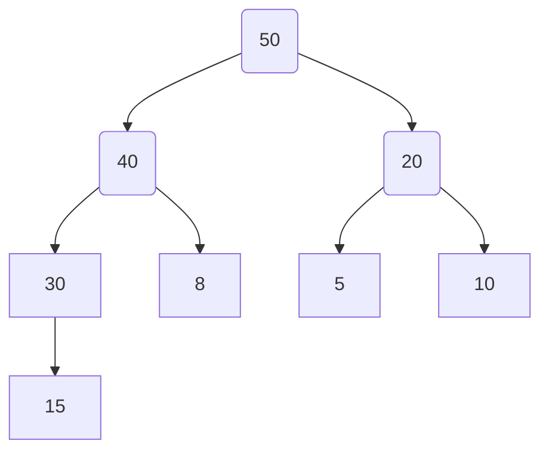

- This heap is now in max heap form

- The time complexity of the insertion operation into a heap is max $O(log[n])$, and minimum $O(1)$

**Removal**

- Let us again consider the same max heap from the original example


- Using heap operations, only the maximum value, or the root, can be removed from the heap 

- First, we want to remove the root, and then move the last element to the root's previous position

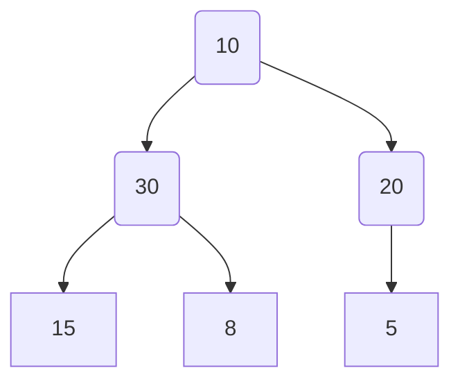

- This is a *complete binary tree* but it is not a max heap

- Now, compare the two children of the root, and if the root is smaller than the larger of the two children, that child and parent will swap, leaving


- This is still not a max heap, so we will repeat the preceding operation with 10
  
  - Compare 15 and 8
    
    - 15 is larger
  
  - Compare 10 with 15
    
    - Since 15 is larger, swap 10 and 15


- Now this is a *complete binary tree*, in the *max heap* form 

- Let us examine the starting and ending arrays:

| Index       | 1   | 2   | 3   | 4   | 5   | 6   | 7   |
| ----------- | --- | --- | --- | --- | --- | --- | --- |
| **Element** | 40  | 30  | 20  | 15  | 8   | 5   | 10  |

$$
\downarrow
$$

| Index       | 1   | 2   | 3   | 4   | 5   | 6   | 7   |
| ----------- | --- | --- | --- | --- | --- | --- | --- |
| **Element** | 30  | 15  | 20  | 10  | 8   | 5   |     |

- Here we can see that the last index of the array is empty, allowing us to store the removed element, which is the largest, at the end of the array

| Index       | 1   | 2   | 3   | 4   | 5   | 6   | 7    |
| ----------- | --- | --- | --- | --- | --- | --- | ---- |
| **Element** | 30  | 15  | 20  | 10  | 8   | 5   | *40* |

- If we repeat this process until the heap is empty, we will have an array that is sorted from smallest to largest, which illustrates the fundamental idea of the heap sort algorithm

**Heapify**

- Heapify is an alternative to insertion when it comes to operations that allow us to construct heap data structures

- First, let us consider the following array

| Index       | 1   | 2   | 3   | 4   | 5   | 6   | 7   |
| ----------- | --- | --- | --- | --- | --- | --- | --- |
| **Element** | 8   | 17  | 13  | 9   | 37  | 23  | 15  |

- We will start with a heap in the order of the array, i.e.


- Then, we compare 15 and 23, and swap the larger of the two with its parent if it is larger than the parent as well
  
  - In this case $23>13$, so we swap the two of them and move to the other side of the heap and repeat the operation, such that 17 and 37 will be swapped

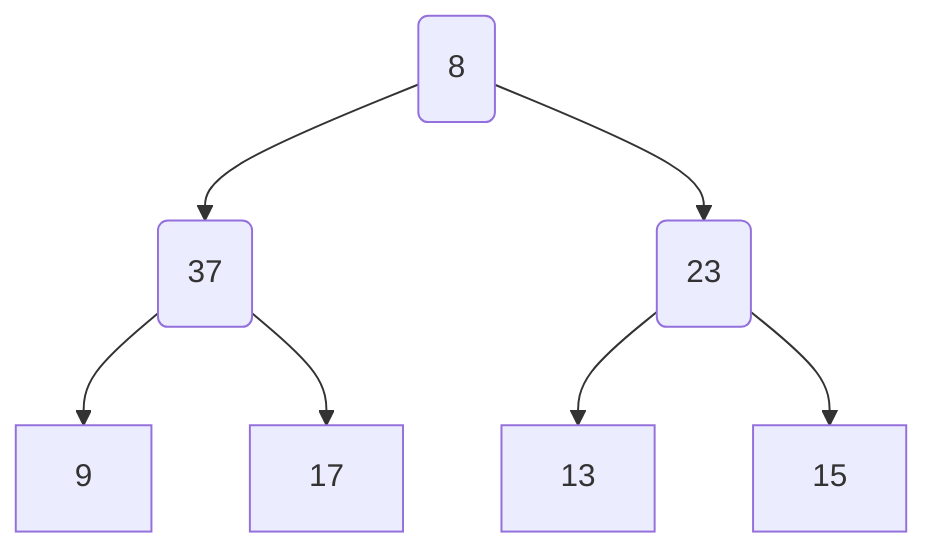

- Next, move to the higher level and repeat the process such that the heap's largest number is now guaranteed to be the root

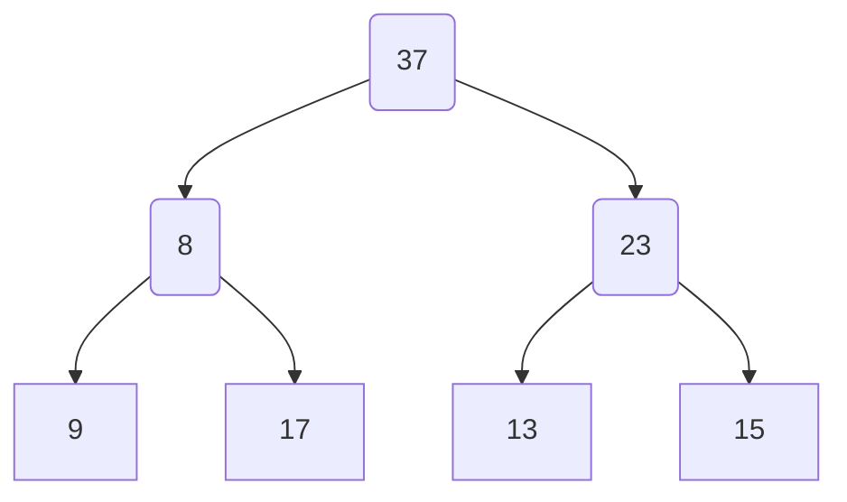

- Now, we can begin again from the end of the heap and repeat this process until we have a heap in max heap form 

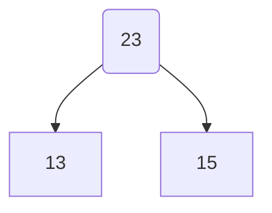

- This sub-heap is in proper form, and does not need to be altered

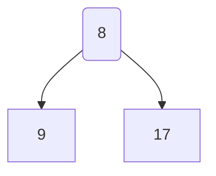

- This sub-heap requires the larger of 17 and 9, (17) ti be swapped with 8, resulting in 

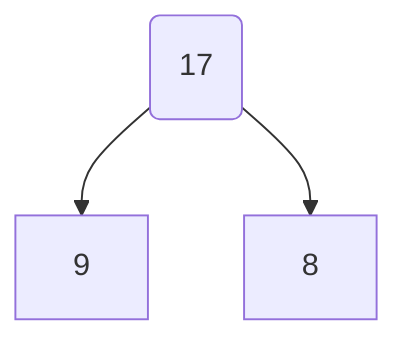

- Now, when we look at the full heap:

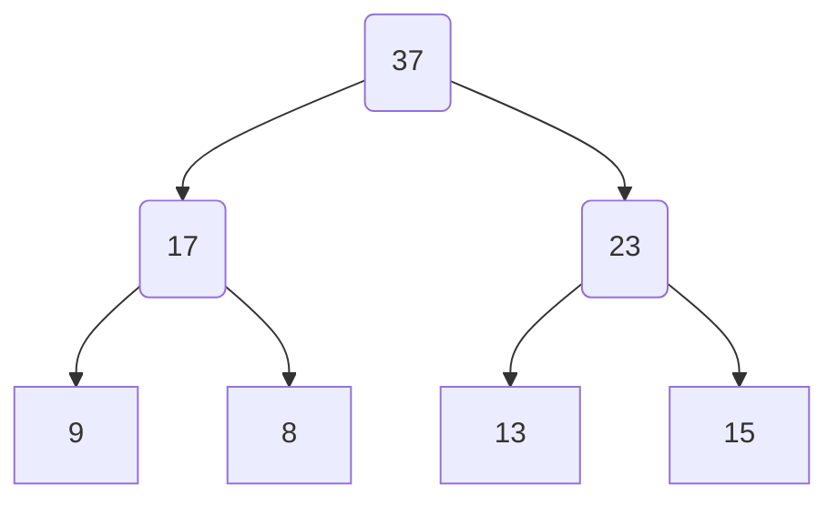

- We can see that it is in max heap form and we are now ready to conduct one-by-one removal in order to complete the heap sort of this array

#### Heap Sort Algorithm

- Consider we have the following integer array which we want to sort using the heap sort algorithm

| Index       | 1   | 2   | 3   | 4   | 5   |
| ----------- | --- | --- | --- | --- | --- |
| **Element** | 10  | 20  | 15  | 30  | 50  |

- Our first step will be to create a heap from this array

- First, will add 10 as the root

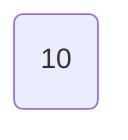

- Next, we will add 20 as 10's left child and compare them to check if the resulting heap is in max heap form

- If it is not, the parent and child will be swapped

```mermaid
graph
A(20)
A-->10
```

- So, we will individually insert these elements into a heap in max heap form, until we are left with an appropriate heap which we can sort by removing elements one by one

```mermaid
graph

A(50)
A-->B(30)
A-->C(15)
B-->10
B-->20
```

- Now, we can delete these elements one by one

```mermaid
graph

A(30)
A-->B(20)
A-->C(15)
B-->10
```

****

```mermaid
graph

A(20)
A-->B(10)
A-->C(15)

```

****

```mermaid
graph 
A(15)
A-->10
```

****

```mermaid
graph
A(10)
```

****

**Sorted Array**

| Index       | 1   | 2   | 3   | 4   | 5   |
| ----------- | --- | --- | --- | --- | --- |
| **Element** | 10  | 15  | 20  | 30  | 50  |

- The time complexity both of heap creation, and of element deletion is $O(nlog[n])$, so the total time complexity of the heap sort algorithm is $2*nlog[n]=O(nlog[n])$


