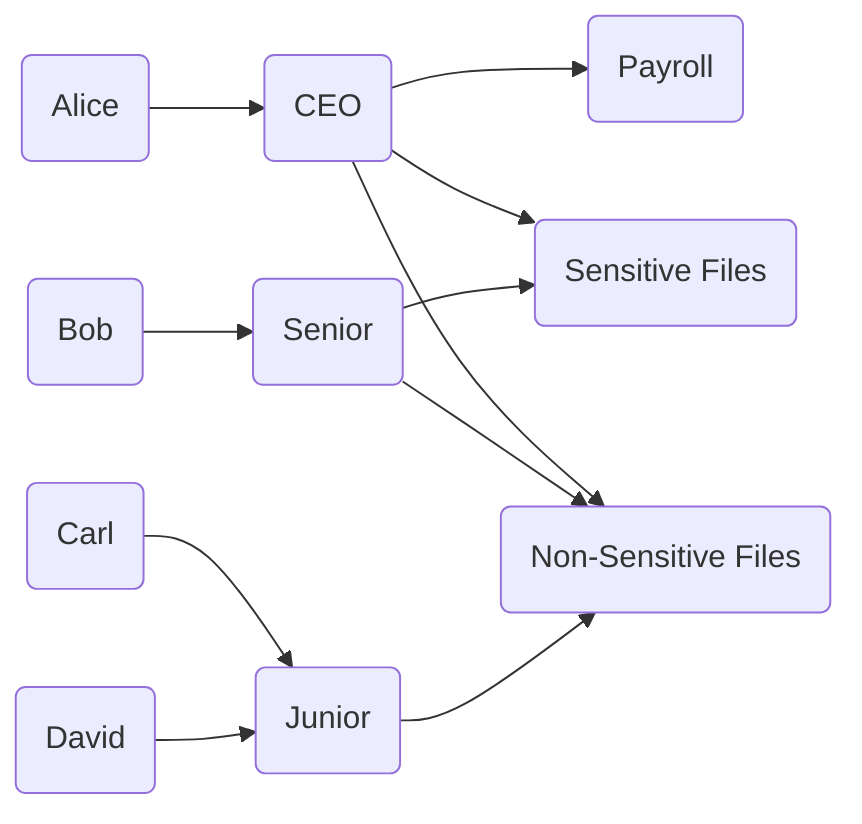

**Justin Ciocoi**

**Feb. 15, 2024**

# CSCI 400 Textbook Notes

## Chapter 4: Access Control

### 4.1: Access Control Principles

- There are two prevalent definitions of access control in the realm of computer science
  
  - NISTIR 7298 defines access control as the process of granting or denying specific requests to 
    
    1. obtain and use information and related information processing services
    
    2. enter specific physical facilities
  
  - RFC 4949 defines access control as a process by which use of system resources is regulated according to a security policy and is permitted only by authorized entities according to that policy

- **Basic Security Requirements**
  
  - Limit information system access to authorized users, processes acting on behalf of authorized users, or devices
  
  - Limit information system access to the types of transactions and functions that authorized users are permitted to execute 

- **Derived Security Requirements**
  
  - Control the flow of controlled unclassified information (CUI) in accordance with approved authorizations
  
  - Separate the duties of individuals to reduce the risk of malevolent activity without collusion
  
  - Employ the principle of least privilege, including for specific security functions and privileged accounts
  
  - Use non-privileged account roles when accessing non-security functions
  
  - Prevent non-privileged users from executing privileged functions and audit the execution of such functions
  
  - Limit unsuccessful logon attempts
  
  - Provide privacy and security notices consistent with applicable CU rules

- **Access Control Policies**
  
  - Discretionary Access Control, which. controls access based don the identity of the requestor and on access rules
  
  - Role-Based Access Control, which controls access based various roles assigned to individuals within an organization
  
  - Mandatory Access Control compares security labels with security clearances
  
  - Attribute-Based Access Control, which controls access based on the attributes of the requesting user

### 4.2: Subjects, Objects, and Access Rights

- A **subject** is an entity that is capable of accessing objects

- There are three classes of subject
  
  - Owner
  
  - Group
  
  - World/Everyone

- An **object** is a resource to which access is controlled, and it is used to contain and/or receive information

- An **access right** describes the way in which a subject may access an object 

- Access rights could include the following
  
  - Read
  
  - Write
  
  - Execute
  
  - Delete
  
  - Create
  
  - Search

### 4.3: Discretionary Access Control (DAC)

- DAC is a scheme in which an entity may be granted access rights that permit the entity, by its own violation, to enable another entity to access some matrix

- DAC is often provided using an access matrix, where
  
  - One dimension consists of identified subjects that may attempt data access to the resources
  
  - The other dimension lists the objects that may be accessed

- Each entry in the matrix indicates the access rights of a particular subject for a particular object 

- The following is depiction of an access matrix 
  
  

- Most often, access matrices are implement through decomposition in one of two ways
  
  - Breaking the matrix down column by column yields **Access Control Lists (ACLs)** for each object stating every user's access right
  
  - Breaking the matrix down row by row yields **Capability Tickets** for each user stating their access rights for every object

- To represent the protection state of a matrix, we should extend the universe of objects within the access control matrix to include all of the following
  
  - **Processes**
  
  - **Devices**
  
  - **Memory Locations**
  
  - **Subjects**

- This will leave us with an extended access control matrix in the following form
  
  

### 4.5: Role-Based Access Control (RBAC)

- This is when a company or organization uses predefined roles for each individual user rather than implementing different access rights for every individual user 

- This can be understood very simply from the following diagram

### 4.6: Attribute-Based Access Control (ABAC)

- There are three key attributes to an ABAC model
  
  - **Attributes**
    
    - The following are the three types of attributes in the ABAC model
      
      - **Subject Attributes**, which define the identity and characteristics of a subject
      
      - **Object Attributes** which have attributes that are commonly used in making access control decisions
      
      - **Environment Attributes**, which are largely ignored in ABAC models 
  
  - **Access Policy Models**
  
  - **Architecture Models**

- Below we can see how ACLs and ABACs differ in their relationship between credentials and trust
  
  

### 4.7: Identity, Credential, and Access Management (ICAM)

- ICAM refers to a comprehensive approach to managing and implementing digital identities, credentials, and access control

- This was developed by the US Government

- ICAM is designed to
  
  - Create trust digital identity representations
  
  - Bind those identities to credentials that may serve as a proxy for the individual in access transactions
  
  - Use the credentials to provide authorized access to resources

- **Identity Management**
  
  - This is concerned with assigning attributes to a digital identity and connecting that entity to a person or non person entity
  
  - The goal is to establish a trustworthy digital identity that is independent of a specific application or context
  
  - The most common approach is to use specified digital identities for each application or context rather than an independent one

- **Credential Management**
  
  - This includes the management of the life cycle of the credential
  
  - A credential could be a smart card, cryptographic key, digital certificate, etc. 
  
  - Credential management encompasses five logistical goals
    
    - An authorized individual sponsors another for a credential
    
    - The sponsored individual then enrolls for the credential
    
    - The credential is produced
    
    - The credential is issued to the individual or NPE
    
    - A credential must be maintained over its life cycle

- **Access Management**
  
  - Deals with the management of how access rights are granted
  
  - Covers both the physical and logical access
  
  - May be internal to a system or an external element
  
  - Three support elements are needed for an enterprise-wide access control facility
    
    - Resource management, which is concerned with defining the rules for a resource which requires access control
    
    - Privilege management, which is concerned with establishing and maintaining the attributes that comprise an individual's access profile
    
    - Policy management, which governs what is allowable and unallowable in an access transaction

### 4.8: Trust Frameworks

- **Identity Federation** is a term used. to describe the technology, standards, policies, and processes that allow an organization to trust digital identities, attributes, and credentials created and issued by another organization

- This addresses the following two questions
  
  - How can one trust identities of individuals from external organizations who need access to your systems
  
  - How do you vouch for identities of individuals in your organization when they need to collaborate with external organizations
