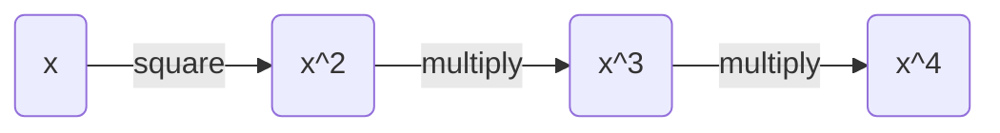
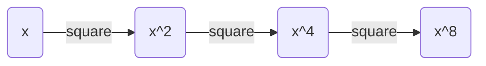

**Justin Ciocoi**

**Nov. 9, 2023**

# CSCI 360 Textbook Notes

## Chapter 7: The RSA Cryptosystem

#### 7.1: Introduction

- The RSA Crypto scheme is currently the most widely used asymmetric cryptographic scheme

- There are many different applications for RSA, but in practice it is most often used for
  
  - Encryption of *small* pieces of data, especially when dealing with *key transport*
  
  - Digital signatures, which are used for digital certificates on the internet

- It should be noted however, that RSA is not intended to replace symmetric cryptography due to the fact that RSA is several times slower as ciphers such as AES
  
  - This is because of the many computations which are involved in the RSA algorithm

- The underlying one-way function of RSA is the integer factorization problem:
  
  - Multiplying two large primes is computationally easy 
  
  - Factoring the resulting problem is computationally hard

#### 7.2: Encryption and Decryption

- **RSA Encryption**
  
  - Given the public key $(n,e)=k_{pub}$ and the plaintext, $x$, the encryption function is:
    
    $$
    y=e_{k_{pub}}(x)\equiv x^e\ mod\ n
    $$
    
    where $x,y \in \Z_n$

****

- **RSA Decryption**
  
  - Given the private key $d=k_{pr}$ and the ciphertext $y$, the decryption function is:
    
    $$
    x=d_{k_{pr}}(y) \equiv y^d\ mod\ n
    $$
    
    where $x,y\in\Z_n$

****

- In practice, the variables, $x, y, n, d$, are very long numbers, usually 1024 bits long or more

- $e$ is often referred to as the *encryption exponent* or *public exponent*, and $d$ is often referred to as the *decryption exponent* or *private exponent*

- Let us say user A wants to send a message to user B
  
  - User A must first have user B's public key, $(n,e)$
  
  - User B will decrypt the message using their private key $d$

- We can now state a few requirements for the RSA cryptosystem
  
  - Since an attacker has access to the public key, it must be computationally infeasible to calculate $d$ given public key values $e$ and $n$
  
  - Since $x$ is only unique up to the size of the modulus $n$, more than $l$ bits cannot be encrypted with one RSA encryption, where $l$ is the bit length of $n$
  
  - It should be relatively easy to calculate $x^e\ mod\ n$ (encryption) and $y^d\ mod\ n$ (decryption)
    
    - This means we need a method for fast exponentiation with very long numbers
  
  - For a given $n$, there should be many private/public key pairs, otherwise an attacker might be able to perform a brute force attack 

#### 7.3: Key Generation and Proof of Correctness

- A distinctive feature of all asymmetric cryptosystems is that there is a set-up phase during which the public and private keys are computed

- Depending on the scheme, key generation can be quite complex, which is usually not an issue for block or stream ciphers 

- **RSA Key Generation**
  
  - **Output:** public key: $k_{pub}=(n,e)$ and private key $k_{pr}=(d)$
    
    1. Choose two large primes, $p$, and $q$
    
    2. Compute $n=p\cdot q$
    
    3. Compute $\Phi(n)=(p-1)(q-1)$
    
    4. Select the public exponent $e\in[1,2,...,\Phi(n)-1]$ such that 
       
       $$
       gcd(e, \Phi(n))=1
       $$
    
    5. Compute the private key $d$ such that 
       
       $$
       d\cdot e\equiv mod\ \Phi(n)
       $$

****

- The condition for public exponent selection will ensure that the inverse of $e$ exists in modulo $\Phi(n)$, such that there will always be a private key $d$

- The computation of $d$ and $e$ can be done at once using the extended Euclidean algorithm
  
  - In practice, one first selects a public parameter $e$ in the range $0<e<\Phi(n)$, where the value of $e$ satisfies the relationship $gcd(e, \Phi(n))=1$
  
  - We can apply the extended Euclidean algorithm with the input parameters $n$ and $e$ and obtain the following relationship
  
  $$
  gcd(\Phi(n),e)=s\cdot\Phi(n)+t\cdot e
  $$
  
  - Where we know that $e$ is a valid public key if $gcd(e, \Phi(n))=1$
  
  - We also know that the parameter $t$ calculated using the extended Euclidean algorithm is the inverse of $e$ and thus
  
  $$
  d=t\ mod\ \Phi(n)
  $$
  
  - In the case that $e$ does not satisfy the above condition, we simply choose a new value for $e$ and repeat the process

- Here we can see an example
  
  

- Expressed as an equation, we can consider the process as:
  
  $$
  d_{k_{pr}}(y)=d_{k_{pr}}(e_{pub}(x))\equiv (x^e)^d\equiv x^{de}\equiv x\ mod\ n
  $$

#### 7.4: Encryption and Decryption: Fast Exponentiation

- Since asymmetric algorithms are based on arithmetic with very long numbers, we need a method by which to quickly exponentiate large integers such that asymmetric schemes do not use too much system overhead in encryption and decryption

- Recall the RSA encryption and decryption functions
  
  $$
  y=e_{k_{pub}}(x)\equiv x^e\ mod\ n \newline
x=d_{k_{pr}}(y)\equiv y^d\ mod\ n
  $$

- A straightforward exponentiation method looks as follows



- For example, to compute the value of $x^8$ would require one squaring and six multiplications

- Instead, we could do the following



- This requires only 3 operations as opposed to the seven from the naive approach

- However, for a specific given exponent, we do not know the exact order of the square and multiply operations, and we thus have an algorithm which provides a systematic way to check the order of these operations

- **Square-and-Multiply Algorithm for Modular Exponentiation**
  
  - *Input:*
    
    - Base element: $x$
    
    - Exponent: $H=\sum_{i=0}^th_i2^i$ with $h_i \in [0,1]$ and $h_t=1$ and modulus $n$
  
  - *Output:* $x^H\ mod\ n$
  
  - *Initialization:* $r=x$
  
  - *Algorithm:*
    
    ```
    for(i=t-1; i!=0; i++)
    {
        r = (r*r) mod n
        
        if(h_i == 1)
            r = (r*x) mod n
    }
    return r
    ```

#### 7.5: Speed-up Techniques for RSA

- **7.5.1: Fast Encryption with Short Public Exponents**
  
  - When concerned with the public exponent, $e$, which is used for encryption, we can choose a very small value for $e$
    
    - In practice, the values $3$, $17$, and $2^{16}+1$ are of particular importance for RSA
    
    - Below we can see a table of the complexities of the three important public exponents
    
    
  
  - RSA is still secure when using these particularly short public exponents
  
  - This scheme is useful for speeding up the encryption portion of RSA, but when the public key, $d$ is involved, i.e. for decryption or signature generation, it is not possible to speed RSA up with this technique

- **7.5.2: Fast Decryption with the Chinese Remainder Theorem**
  
  - In RSA, a short private key cannot be chosen without compromising the security of encryption
  
  - The goal here is to perform $x^d\ mod\ n$ efficiently
    
    - The party who possesses the private key also possesses the primes $p$ and $q$
    
    - The basic idea of the Chinese Remainder Theorem is that rather than doing arithmetic with one long modulus, $n$ we can perform two individual exponentiations modulus the shorter primes $p$ and $q$
    
    - We have to transform *into* the CRT domain, perform computations within the CRT domain, and inverse transform to find the result
  
  - First we reduce x to obtain what is known as the *modular* representation of $x$
    
    $$
    x_p\equiv x\ mod\ p \newline
x_q\equiv x\ mod\ q
    $$
  
  - Now, we will perform the following exponentiations
    
    $$
    y_p=x_p^{d_p}\ mod\ p \newline
y_q=x_q^{d_q}\ mod\ q
    $$
  
  - Where the exponents $d_i$ are given by
    
    $$
    d_p\equiv d\ mod\ (p-1)\newline
d_q\equiv d\ mod\ (q-1)
    $$
  
  - To perform the inverse transformation we must first compute two coefficients given by
    
    $$
    c_p\equiv q^{-1}\ mod\ p\newline
c_q\equiv p^{-1}\ mod\ q 
    $$
  
  - And then assemble the final result, $y$
    
    $$
    y=[q*c_p]y_p+[p*c_q]y_q\ mod\ n
    $$
  
  - The total speed-up obtained by this implementation of the Chinese Remainder Theorem is a factor of 4, and there are hardly any drawbacks, so it is very frequently used in real-world cryptographic applications

#### 7.6: Finding Large Primes

- One thing that hasn't been discussed is how the two primes $p$ and $q$ are generated 

- Since their product is the RSA modulus, $n=p\cdot q$, each of the two primes should have about half the bit length of $n$
  
  

- The practicality of this approach is put into question by two factors
  
  - The likelihood of finding a prime number using an RNG
  
  - The speed at which we can check whether the randomly generated number is prime or composite

- **Fermat Primality Test**
  
  - One primality test which is commonly used is based on *Fermat's Little Theorem* 
  
  - *Input:* prime candidate $\tilde p$ and security parameter $s$
  
  - *Output:* statement "$\tilde p$ is composite" or "$\tilde p$ is likely prime"
  
  - *Algorithm:*
    
    ```
    for(i=1; i<s; i++)
    {
        choose random a in {2, 3, 4, ..., p-2}
        if a^{p-1} != 1
            return p is composite
    }
    return p is likely prime
    ```
  
  - Since this algorithm is still capable of producing incorrect results via Carmichael numbers, or *Fermat liars*

- **Miller-Rabin Primality Test**
  
  - For a given odd integer, $n>2$, we can write $n-1$ as $2^sd$ where $s$ is a positive integer and $d$ is an odd positive integer
  
  - We will then consider an integer $a$ which we can call the *base*, which is co-prime to $n$
  
  - Then, $n$ is said to be a *strong probable prime* to base $a$ if one of these congruence relations holds
    
    $$
    a^d\equiv 1\ (mod\ n)\newline
a^{2^rd}\equiv -1\ (mod\ n)
    $$
    
    where $0\le r<s$

#### 7.7: RSA in Practice: Padding

- In practice, RSA has to be used with a *padding scheme* which is extremely important and can lead to insecurity if they are not implemented properly 

- This is due to the problematic properties of RSA encryption listed below
  
  - RSA encryption is deterministic, i.e., for a specific key, a particular plaintext is always mapped to a particular ciphertext, creating vectors for a potential statistical attack 
  
  - Plaintext values $x=0,x=1,x=-1$ produce ciphertexts equal to  $0,1,-1$
  
  - Small public exponents $e$ and small plaintexts $x$ might be subject to attacks if no padding, or weak padding, is used

- Another undesirable property of RSA is that it is *malleable*
  
  - This means that the attacker is capable of transforming the ciphertext into another ciphertext which leads to a known transformation of the plaintext
  
  - The attacker cannot decrypt the ciphertext here, but they are capable of manipulating the plaintext in a predictable manner 

- One possible solution to all of the problems mentioned above is the use of padding

- Modern techniques, such as the *Optimal Asymmetric Encryption Padding (OAEP)* for padding RSA messages are specified and standardized in *Public Key Cryptography Standard #1 (PKCS#1)*

- Let $M$ be the message which will be padded, let $k$ be the length of modulus $n$ in bytes, let $|H|$ be the length of the hash function output in bytes, and let $|M|$ be the length of the message in bytes

- Let $L$ be an optional label which is left as an empty string if not used

- According to the most recent standard, padding a message within the RSA Encryption scheme is done in the following way:
  
  1. Generate a string, $PS$ of length $k-|M|-2|H|-2$ of zeroed byte
     
     - The length of $PS$ may be 0
  
  2. Concatenate $hash(L), PS$, a single byte with ha hexadecimal value of $0x01$, and the message $M$, to form a data block, $DB$ of length $k-|H|-1$ bytes
     
     - $$
       DB = Hash(L)||PS||0x01||M
       $$
  
  3- Generate a random byte string *seed* of length $|H|$
  
  4- Let $dbMask = MGF(seed, k-|H|-1)$, where MGF is the mask generation function which, in practice, is often a hash function such as SHA-1
  
  5- Let $maskedDB=DB\oplus dbMask$
  
  6- Let $seedMask = MGF(maskeedDB, |H|)$
  
  7- Let $maskedSeed = seed \oplus seedMask$
  
  8- Concatenate a single byte with hexadecimal value $0x00$, $maskedSeed$, and $maskedDB$ to form an encoded message, $EM$, of length $k$ bytes
  
  - $$
    EM=0x00||maskedSeed||maskedDB
    $$
  
  
